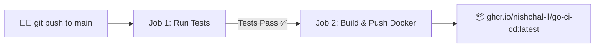

# Go CI/CD Pipeline with Docker & GitHub Container Registry (GHCR)

[](https://github.com/Nishchal-ll/Go-CI-CD/actions/workflows/ci.yml)
[](LICENSE)

A lightweight Go web server featuring an automated **CI/CD Pipeline** that runs unit tests, builds an optimized multi-stage Docker image, and automatically publishes the container to **GitHub Container Registry (GHCR)**.

---

## 📁 Project Structure

```text
.
├── .github/
│   └── workflows/
│       └── ci.yml        # GitHub Actions CI/CD workflow (Tests + Docker Push)
├── .dockerignore         # Files excluded from Docker context
├── Dockerfile            # Multi-stage minimal Go container build
├── go.mod                # Go module definition
├── main.go               # HTTP web server
├── main_test.go          # Unit tests
└── README.md             # Documentation
```

---

## 🚀 Running Locally

### Option 1: Run with Go
```bash
# Start server
go run main.go

# Run tests
go test -v ./...
```

### Option 2: Run with Docker
```bash
# Build the image locally
docker build -t go-ci-cd:local .

# Run the container on port 8080
docker run -p 8080:8080 go-ci-cd:local
```

Open [http://localhost:8080](http://localhost:8080) or [http://localhost:8080?name=Nishchal](http://localhost:8080?name=Nishchal).

---

## 🐳 Pulling from GitHub Container Registry (GHCR)

Once pushed to GitHub, you can pull and run the published image directly:

```bash
docker run -p 8080:8080 ghcr.io/nishchal-ll/go-ci-cd:latest
```

---

## ⚙️ How the CI/CD Pipeline Works



1. **Job 1 (Test)**: Checks out code, sets up Go, and runs `go test -v -race -cover ./...`.
2. **Job 2 (Docker Build & Push)**: 
   - Depends on `test` job passing.
   - Logs into GitHub Container Registry using `${{ secrets.GITHUB_TOKEN }}` (no external setup required).
   - Builds the optimized multi-stage image using Docker Buildx and GitHub Actions layer caching (`type=gha`).
   - Tags the image with `latest` and `sha-<commit_hash>`.
   - Pushes the image to **GHCR**.

---

## 📄 License
This project is licensed under the MIT License - see the [LICENSE](LICENSE) file for details.
