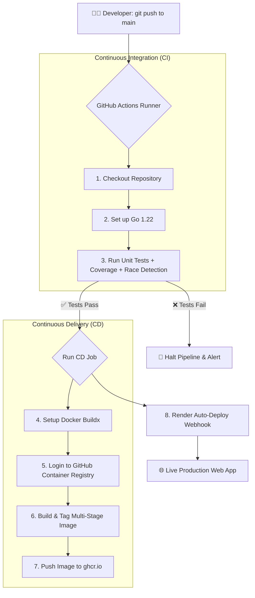

# 🚀 Go CI/CD Pipeline & Automated Deployment

<div align="center">

[](https://github.com/Nishchal-ll/Go-CI-CD/actions/workflows/ci.yml)
[](https://golang.org)
[](Dockerfile)
[](LICENSE)
[](https://github.com/Nishchal-ll/Go-CI-CD/pkgs/container/go-ci-cd)

**A production-ready blueprint demonstrating end-to-end Continuous Integration & Continuous Delivery (CI/CD) for Go microservices using GitHub Actions, Multi-Stage Docker builds, GHCR, and Render.**

[Features](#-key-features) • [Quick Start](#-quick-start) • [CI/CD Pipeline](#-cicd-pipeline-deep-dive) • [Docker & GHCR](#-docker--container-registry) • [Live Deployment](#-live-cloud-deployment)

</div>

---

## ✨ Key Features

- **Automated CI Testing**: Automated unit testing, code coverage analysis, and data race detection on every commit and pull request.
- **Fail-Safe Gatekeeper**: Prevents broken or untested code from progressing to the build or deployment phases.
- **Ultra-Lightweight Multi-Stage Dockerfile**: Builds a fully static, standalone Go binary inside an Alpine runtime (~20MB total container footprint).
- **GitHub Container Registry (GHCR) Publishing**: Zero-config container image publishing using GitHub's built-in `GITHUB_TOKEN`.
- **Continuous Deployment (CD)**: Automated production deployments to cloud platforms (Render) on every push to `main`.
- **Environment-Aware Server**: Dynamically reads the `PORT` environment variable for seamless deployment across local, containerized, and cloud environments.

---

## 📁 Repository Structure

```text
.
├── .github/
│   └── workflows/
│       └── ci.yml        # Multi-job GitHub Actions CI/CD pipeline
├── .dockerignore         # Exclusions for fast, lightweight Docker contexts
├── Dockerfile            # Optimized multi-stage Docker build
├── go.mod                # Go module definition
├── main.go               # HTTP web server & greeting handler
├── main_test.go          # Unit tests covering HTTP handlers & helper logic
├── LICENSE               # MIT License
└── README.md             # Project documentation
```

---

## ⚙️ CI/CD Pipeline Deep Dive



### Pipeline Jobs Breakdown

| Stage | Tool | Description |
| :--- | :--- | :--- |
| **Lint & Test** | `go test -v -race -cover` | Executes all test suites and validates handler responses and business logic. |
| **Docker Build** | Docker Buildx + GitHub Cache | Compiles a statically linked Go binary (`CGO_ENABLED=0`) and builds the runtime container. |
| **Publish** | `ghcr.io` | Tags the image with `latest` and commit SHA (`sha-<hash>`), pushing to GitHub Container Registry. |
| **Deploy** | Render Webhook | Detects repo updates on `main` and rolls out the updated web service live. |

---

## 🚀 Quick Start

### 1. Run Locally with Go
```bash
# Clone the repository
git clone https://github.com/Nishchal-ll/Go-CI-CD.git
cd Go-CI-CD

# Run the server
go run main.go

# Run tests
go test -v ./...
```
Visit [http://localhost:8080](http://localhost:8080) or [http://localhost:8080?name=Nishchal](http://localhost:8080?name=Nishchal).

---

## 🐳 Docker & Container Registry

### Build and Run Locally
```bash
# Build the minimal image
docker build -t go-ci-cd:local .

# Run the container
docker run -p 8080:8080 go-ci-cd:local
```

### Pull and Run from GitHub Container Registry (GHCR)
```bash
docker run -p 8080:8080 ghcr.io/nishchal-ll/go-ci-cd:latest
```

---

## 🌐 API Reference

| Method | Endpoint | Query Param | Example Response | Description |
| :--- | :--- | :--- | :--- | :--- |
| `GET` | `/` | `name` *(optional)* | `Hello, Nishchal (Docker part)!` | Returns customized or default greeting |
| `GET` | `/?name=Alice` | `name=Alice` | `Hello, Alice!` | Returns personalized greeting for query |

---

## ☁️ Live Cloud Deployment

This service is configured for zero-downtime automated deployment on **Render**:
1. **Runtime**: `Go`
2. **Build Command**: `go build -o server .`
3. **Start Command**: `./server`
4. **Environment**: `PORT` automatically injected by the cloud host.

---

## 📚 Concepts Demonstrated

- [x] Writing testable Go HTTP handlers (`httptest.ResponseRecorder`).
- [x] Defining GitHub Actions workflows with dependent jobs (`needs: test`).
- [x] Configuring secure runner authentication using GitHub Secrets (`GITHUB_TOKEN`).
- [x] Multi-stage Docker builds to reduce image size from >800MB to **~20MB**.
- [x] GitHub Container Registry (GHCR) integration with dynamic commit SHA tags.
- [x] Continuous Deployment (CD) integration with cloud hosting platforms.

---

## 📄 License
Distributed under the MIT License. See [LICENSE](LICENSE) for more information.
